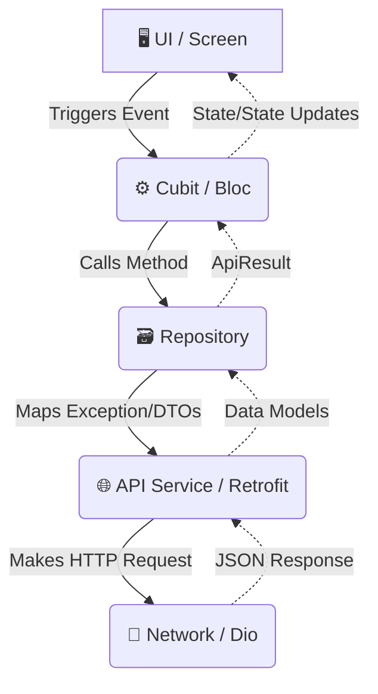

# Project Rules and Guidelines (Production Architecture Guide)

This document outlines the architecture, coding standards, and best practices for this Flutter project. It serves as a comprehensive guide for developers (and AI IDEs like Cursor/Copilot) to maintain consistency, enforce security, and streamline development.

---

## 🏗️ 1. Project Overview & Architecture Pattern

### Architecture: Clean Architecture (Feature-First)
The project strictly follows a **Clean Architecture** approach tailored for Flutter, organized by feature. Each feature must be isolated into distinct layers to ensure separation of concerns, testability, and scalability.

### Core Architecture Layers:
Every feature folder must adhere to the following 3-tier structure:
1. **Data Layer**: Handles external APIs, local caching, and models.
2. **Domain Layer**: (Optional but recommended for scale) Contains business logic, entities, and use cases.
3. **Presentation Layer**: Handles UI (Widgets/Screens) and State Management (Cubit/Bloc).

### Recommended Folder Structure
```text
lib/
 ├── app/                   # App-level configurations (Theme, Routing, AppBloc)
 ├── core/                  # Core infrastructure shared across features
 │   ├── errors/            # Error handling & Exception models
 │   ├── extensions/        # Dart extensions
 │   ├── get_it/            # Dependency Injection (DI) registry
 │   ├── helpers/           # Shared utilities (CacheHelper, Connectivity, Responsive)
 │   ├── service/api/       # Network layer (DioFactory, Retrofit, Interceptors)
 │   └── theme/             # App themes, colors, typography
 └── features/              # Business features
     └── [feature_name]/
         ├── data/          # ⬅️ Data Layer
         │   ├── models/    # DTOs and Data Models (e.g., response_login_model.dart)
         │   ├── datasource/# Remote & Local data sources
         │   └── repos/     # Repository implementations
         ├── domain/        # ⬅️ Domain Layer (For complex features)
         │   ├── entities/  # Core business objects
         │   └── usecases/  # Encapsulated feature business logic
         └── presentation/  # ⬅️ Presentation Layer
             ├── cubit/     # State management (Bloc/Cubit)
             ├── widgets/   # Broken down UI components
             └── screens/   # Main feature screen
```

---

## 🔄 2. Dependency Graph & Data Flow

Data must strictly flow unidirectionally from the UI down to the Network layer, and states flow back up. UI components should never communicate directly with the API.



---

## 🛠️ 3. Tech Stack

- **Framework**: Flutter / Dart
- **Networking**: `dio` (HTTP client), `retrofit` (API client generator)
- **State Management**: `flutter_bloc` (specifically `Cubit`)
- **Dependency Injection**: `get_it`
- **Routing & Navigation**: Custom extensions (`extention_navigator.dart`)
- **Localization**: `easy_localization`
- **UI & Responsiveness**: Custom `Responsive` helper class based on `MediaQuery` with cached theme injection.
- **Data Persistence**: `shared_preferences` (via `CacheHelper`) / `flutter_secure_storage` (Recommended)

---

## 📝 4. Naming Conventions & Coding Standards

To ensure AI IDEs and human developers write consistent code, strictly follow these naming rules:
- **Files & Directories**: `snake_case` (e.g., `login_screen.dart`, `api_error_handler.dart`).
- **Classes & Enums**: `PascalCase` (e.g., `LoginCubit`, `ResponseLogin`).
- **Variables & Functions**: `camelCase` (e.g., `emitLoginStates`, `emailController`).
- **Constants**: `camelCase` or `CONSTANT_CASE`. Always group constants inside structural classes (e.g., `ApiConstants.baseUrl`).

---

## 🚀 5. Performance Optimization Rules

Performance is a first-class citizen. Flutter optimization guidelines must be applied to all PRs:

1. **Avoid building large widget trees in `build()`**: Ensure that `build()` methods are small. Break UI down into smaller standalone `StatelessWidget` classes instead of helper methods returning Widgets.
2. **Use `const` Constructors everywhere**: Always add `const` to widgets where the properties don't change to prevent unnecessary framework rebuilds.
3. **Use `ListView.builder`**: Never use a standard `ListView` or `SingleChildScrollView(Column(...))` for long or dynamic lists. Always use `ListView.builder` or `SliverList` for memory recycling.
4. **Avoid heavy logic in `build()`**: The `build` method runs frequently (up to 60/120 times per second during animations). Move heavy parsing or mapping functions to the `Cubit` or `Repository`.

---

## 🧠 6. State Management Approach

The project uses **Cubit** from `flutter_bloc`.

**Rules for State Management:**
1. State layers should clearly define variations: `Initial`, `Loading`, `Success`, and `Failure`.
2. Do **not** pass `BuildContext` into a Cubit. 
3. Cubits must be injected via `get_it` and provided to the view using `BlocProvider`.

### Example: Cubit Logic
```dart
class LoginCubit extends Cubit<LoginState> {
  final LoginRepo _loginRepo;
  
  LoginCubit(this._loginRepo) : super(LoginInitial());

  TextEditingController emailController = TextEditingController();
  TextEditingController passwordController = TextEditingController();

  void login() async {
    emit(LoginLoading());
    final response = await _loginRepo.login(
      emailController.text,
      passwordController.text,
    );

    response.when(
      success: (loginResponse) {
        emit(LoginSuccess(message: loginResponse.message ?? ''));
      },
      failure: (error) {
        emit(LoginFailure(message: error.message ?? '')); // Notice the corrected spelling of 'message'
      },
    );
  }
}
```

---

## 🌐 7. API Communication Patterns

API communication is centralized in `lib/core/service/api`. We map generic API failures into wrapped Result states using `ApiResult`.

### Example: Repository Pattern
Repositories act as the single source of truth for the logic layer, catching exceptions and returning sealed classes.
```dart
class LoginRepo {
  final ApiService _apiService;

  LoginRepo(this._apiService);

  Future<ApiResult<ResponseLogin>> login(String email, String password) async {
    try {
      final response = await _apiService.login({"email": email, "password": password});
      if (response.status == "fail") {
        return ApiResult.failure(ApiErrorModel(status: response.status, message: response.message));
      }
      return ApiResult.success(response);
    } catch (e) {
      return ApiResult.failure(ErrorHandler.handle(e));
    }
  }
}
```

---

## 🚫 8. Error Handling & Logging Strategy

Never expose raw exceptions to the UI. The application uses a central `ErrorHandler` class that intercepts `DioException` types and formats them into a standard `ApiErrorModel`.

### Logging Strategy
Production apps must separate generic prints from diagnostic logs.
1. Use `developer.log()` or a package like `logger` / `talker` instead of `print()`.
2. **Debug Logs Only**: Only print network responses and tracing info in `kDebugMode`.
3. **No Sensitive Data**: Never log passwords, tokens, or PII.

---

## 🎨 9. UI / Component Rules

UI files should be clean, modular, and declarative.
- **Responsiveness**: The project uses a custom `Responsive` class (`lib/core/helpers/responsive.dart`).
  - Scale and layout sizing are calculated at the `app.dart` tier using step-based increments.
  - Sizing is gracefully injected into UI via cached TextThemes (`AppTextThemeCache`).
- Rely on context styling extensions (`context.textStyle.displayLarge`) rather than hardcoding `TextStyle` inside presentation widgets.

---

## 🔒 10. Security Rules & Best Practices

To ensure application safety, always adhere to:

### 1. Token Handling & Secure Storage (Mandatory)
- **Do NOT hardcode API Keys or secrets** directly in the codebase.
- User Tokens (`JWT`) **must** be saved securely using `flutter_secure_storage`. Do not use `shared_preferences` (`CacheHelper`) for sensitive information.

### 2. HTTPS Enforced
- Ensure `DioFactory` enforces HTTPS by verifying `ApiConstants.baseUrl` begins with `https://`.

### 3. Input Validation
- Client-side validation is mandatory to prevent unnecessary API calls and injection attacks.
- Ensure text inputs (like Email and Password) are tightly validated using RegEx before enabling form submission.

### 4. Code Obfuscation
- Code Obfuscation is mandatory for release builds to prevent reverse engineering.
- Command: `flutter build apk --obfuscate --split-debug-info=/<directory>`

---

## 🌿 11. Git Rules & Version Control

To maintain a clean Git history and streamlined CI/CD integrations, all developers must adhere to **Conventional Commits**.

### Branch Strategy
- `main`: Stable production branch.
- `develop`: Integration branch where all features merge.
- `feature/[name]`: For new feature modules.
- `fix/[name]`: For bug fixes.

### Commit Message Format
```text
feat(login): implement secure storage for JWT
fix(api): handle TimeoutException in DioFactory
refactor(core): improve Cubit UI logic performance
build(android): configure ProGuard and Obfuscation
```

---

## 🤖 12. AI / IDE Context Integration

If you are using Cursor, GitHub Copilot, or another AI IDE, please generate the following meta-files at the root of the project to feed these rules into the AI's system prompt:

1. `.cursor/rules/flutter.mdc`: Include points 1, 5, and 6 to ensure the AI creates `const` widgets, uses Cubit correctly, and splits the Presentation/Data layers.
2. `AI_CONTEXT.md`: A summary mapping the `.dart` file directories to their domain counterparts to teach the AI where to scaffold new code.